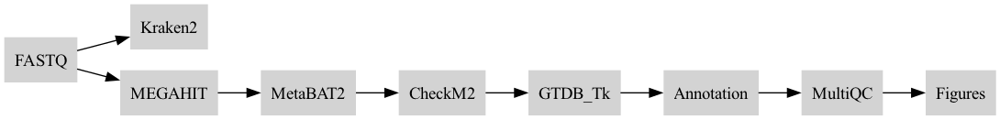
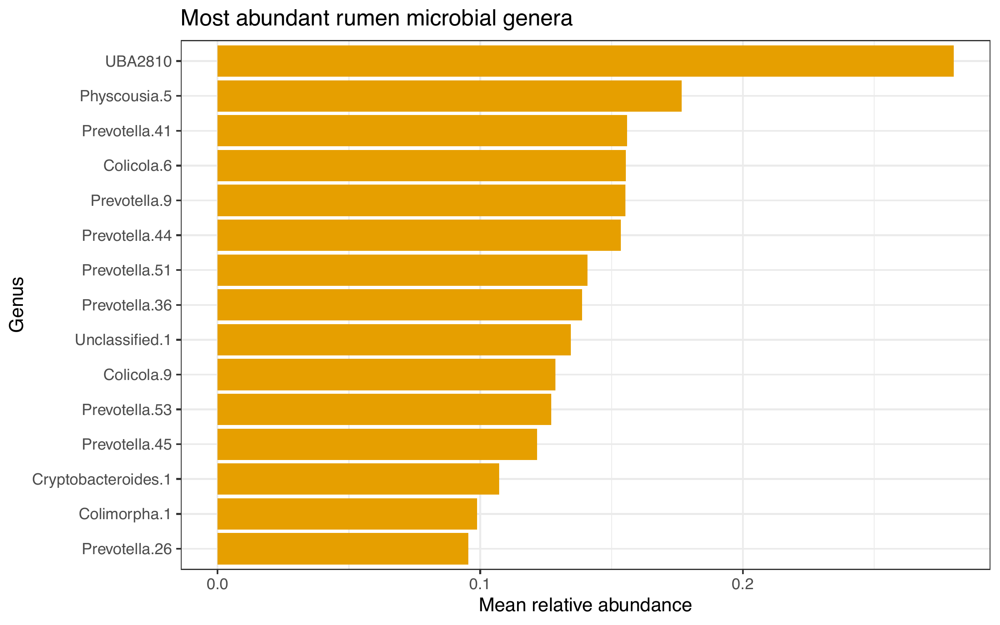
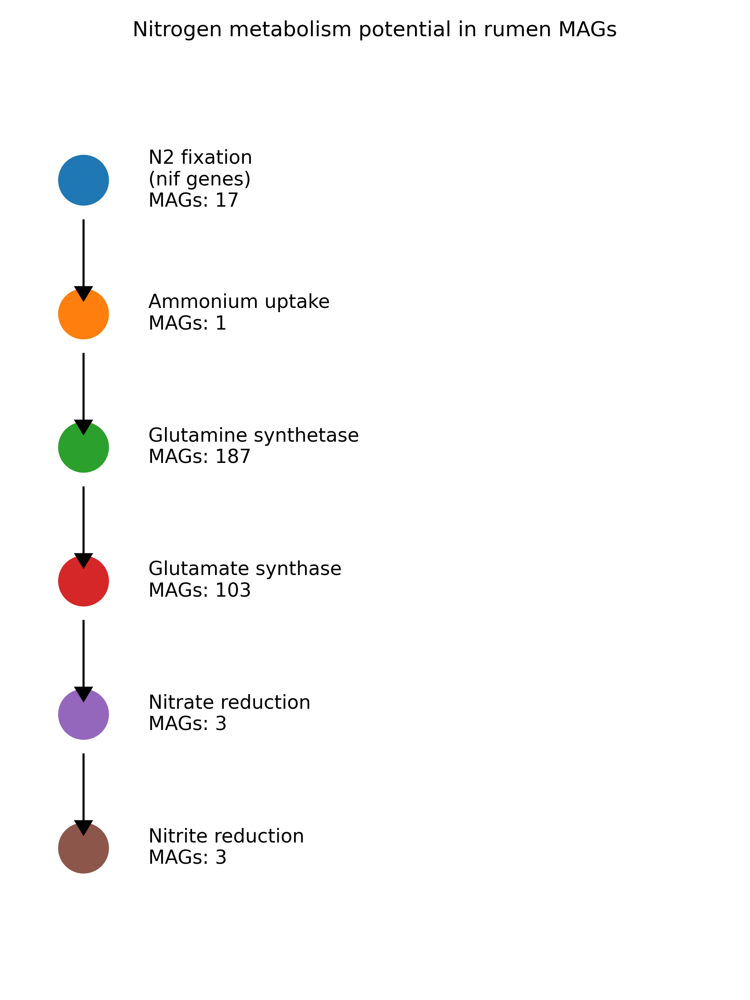
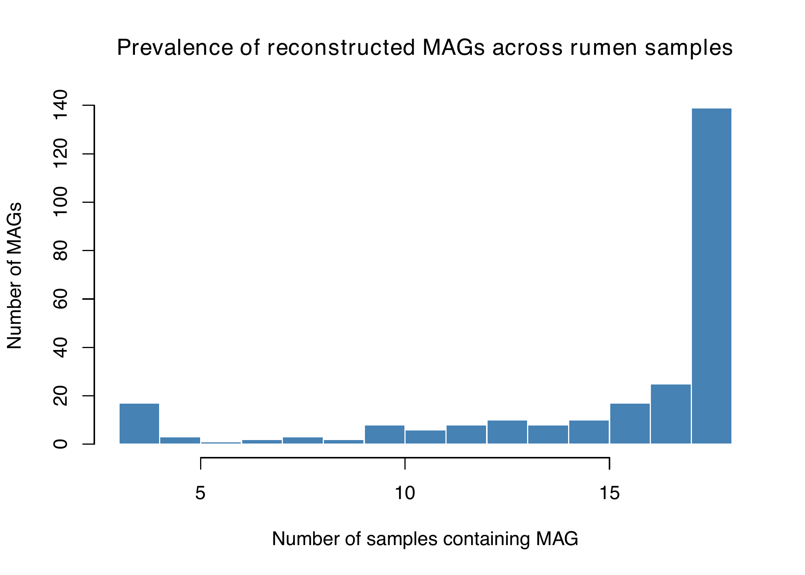

## 🚀 Quick Start

```bash
# Clone repo
git clone https://github.com/ajbellowalker/scalable-metagenomic-analysis-pipeline
cd scalable-metagenomic-analysis-pipeline

# Run pipeline
nextflow run main.nf -profile conda
```

# 🧬 Scalable Metagenomic Analysis Pipeline (Nextflow + AWS-ready)

A modular, reproducible metagenomics pipeline built using Nextflow DSL2 for taxonomic profiling, assembly, genome binning, and MAG analysis.

## 🚀 Features

- ⚙️ Fully modular Nextflow DSL2 workflow  
- 🧬 Taxonomic classification using Kraken2  
- 🧱 Assembly using MEGAHIT  
- 🧪 Genome binning with MetaBAT2 (Linux/cloud)  
- 📊 MAG quality assessment with CheckM2  
- 🌍 Taxonomic classification with GTDB-Tk  
- 📈 Automated reporting with MultiQC  
- ☁️ Cloud-ready (AWS / HPC compatible)  

## 🔄 Pipeline Overview



1. Quality-controlled reads are processed for taxonomic profiling (Kraken2)  
2. Reads are assembled into contigs (MEGAHIT)  
3. Contigs are binned into MAGs (MetaBAT2)  
4. MAG quality is assessed (CheckM2)  
5. Taxonomy is assigned (GTDB-Tk)  
6. Outputs are summarised with MultiQC and custom visualisations

Workflow management: Nextflow (DSL2)
Reproducibility: Conda / Micromamba environments  

## 📦 Installation

```bash
git clone https://github.com/ajbellowalker/scalable-metagenomic-analysis-pipeline
cd scalable-metagenomic-analysis-pipeline
```

## ▶️ Run Pipeline (Local)

```bash
nextflow run main.nf -profile conda
```

## ☁️ Run Full Pipeline (Cloud / HPC)

```bash
nextflow run main.nf -profile conda \
--run_megahit true \
--run_metabat2 true \
--run_checkm2 true \
--run_gtdbtk true
```

## 📊 Output

results/		  
├── kraken2/		  
├── megahit/		  
├── metabat2/			  
├── checkm2/		  
├── gtdbtk/		  
├── multiqc/	  	

## 📈 Results Overview


**Figure 1. Taxonomic composition at genus level.**  
Relative abundance of dominant microbial genera identified from shotgun metagenomic sequencing using Kraken2. The community is characterised by taxa associated with fibre degradation and rumen fermentation.

---


**Figure 2. Nitrogen metabolism potential across reconstructed MAGs.**  
Presence/absence of key nitrogen cycling genes identified across metagenome-assembled genomes (MAGs). Functional annotation highlights pathways involved in ammonia assimilation, amino acid metabolism, and nitrogen turnover in the rumen microbiome.

---


**Figure 3. Prevalence of reconstructed MAGs across samples.**  
Distribution of MAG occurrence across samples, showing a core microbiome shared across multiple samples alongside low-prevalence, sample-specific genomes.

## 🔬 Key Findings

- The rumen microbiome is dominated by key bacterial genera involved in fibre degradation  
- Functional annotation of MAGs reveals widespread nitrogen cycling capacity, including ammonia assimilation and amino acid metabolism  
- MAG prevalence analysis identifies a core microbiome shared across samples alongside low-abundance, sample-specific populations  

These results demonstrate the integration of taxonomic, functional, and genome-resolved metagenomics approaches.

## 🌍 Biological Relevance

This pipeline enables genome-resolved analysis of complex microbial ecosystems such as the rumen microbiome.

It supports investigation of:
- Microbial contributions to nitrogen metabolism  
- Microbial protein synthesis and efficiency  
- Community structure and functional potential  

This work contributes to improving nitrogen utilisation and sustainability in livestock systems.

## 🚀 Why This Project Matters

Metagenomic data analysis is computationally intensive and requires scalable, reproducible workflows.

This pipeline demonstrates:
- End-to-end microbiome analysis  
- Cloud-ready bioinformatics engineering  
- Integration of multiple industry-standard tools  
- Reproducible research practices  

Designed for deployment on AWS or HPC environments, this workflow bridges biological insight with computational scalability.

## 🧑‍💻 Author

Ayemere J. Bellowalker  
Bioinformatics | Microbiome | Computational Biology

## 📄 License

MIT
